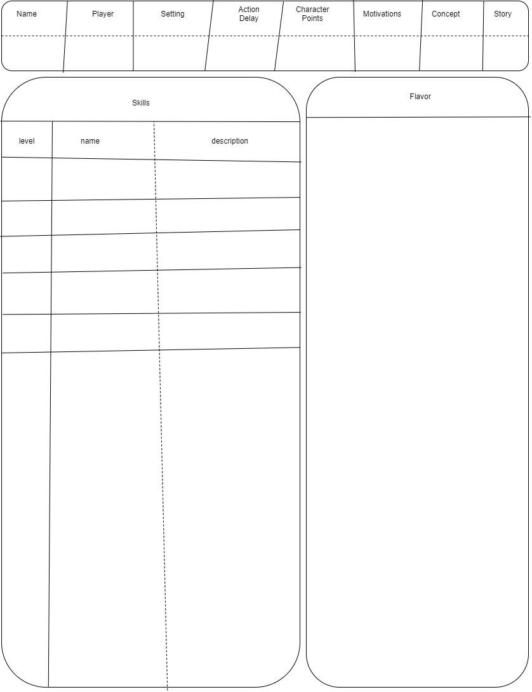
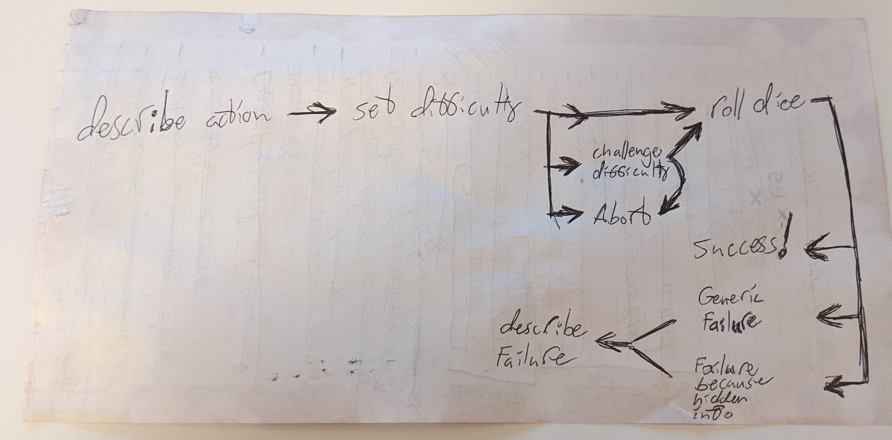
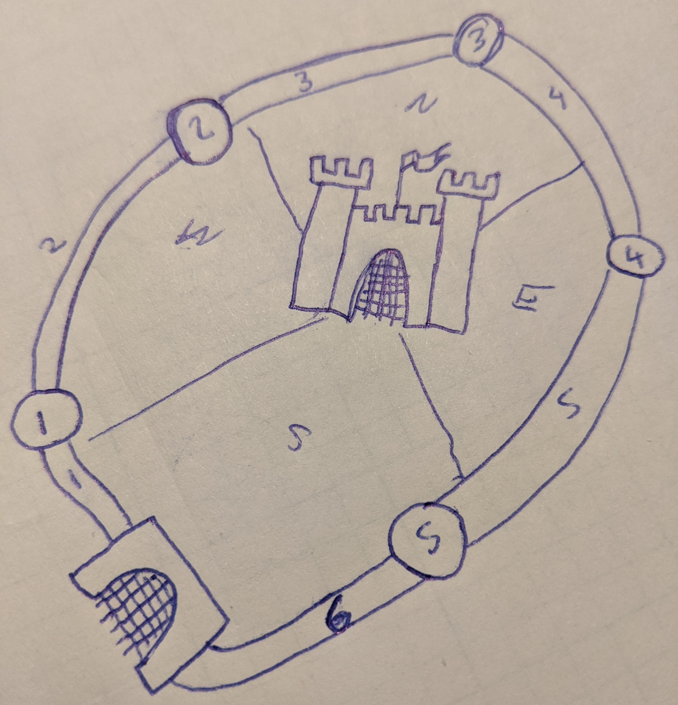

# Introduction
Tabula Rasa is a worldbuilding framework and a rules-light, generic roleplaying game that lets players create their own skills and add to the setting easily.

The worldbuilding framework produces a Setting. Settings are short, standardized, and easily shareable descriptions of a single place within a world. The intent is that Settings can be used to quickly understand a part of the world such that a player can create a Character or the Storyteller can create an Adventure.

The role playing system is generic so it will work with any Setting produced by the worldbuilding framework. The rules are minimal meaning you and your group should be able to create any character imaginable within the Setting and start playing very quickly!

## Getting Started
A night of roleplaying usually lasts anywhere from two to six hours and includes a variety of scenes: Exhilarating chases, nail-biting espionage, terrifying battles, grand speeches, descriptions of exotic lands, and, of course, joking around in and out of character are all hallmarks of good roleplaying.

One player will need to be the storyteller. The storyteller is largely responsible for running the game. A storyteller's responsibilities include setting up scenes between characters, planning and narrating events that drive the story, roleplaying NPCs, setting check difficulties, and managing the setting. Once a storyteller is chosen they should go take a look at the [setting](#setting) section and either create or find a setting for their story.

Everyone else will be a player. Players should go straight to the [character creation](#character-creation) section and begin creating characters using the setting provided by the storyteller. Once a player has a character, they will provide voice acting, motivations, and personality for the character in addition to controlling their actions in the story.

Most good stories include conflict. Once you have a storyteller, a setting, a story, and a character for each player you will need to know how to resolve conflicts. Conflicts are usually between characters and when they arise they can be resolved by rolling [checks](#check). Everyone should make sure they understand how checks work.

## Legend
- examples of specific skills and flavor will be `monospace` in-line
- section specific keywords will be in **bold**
- interjections (like this) will be in parenthesis
- sections will be referenced using [links](#legend)
- > larger examples will be quoted and appear under the relevant section with no header

## Table of Contents
<!-- TOC -->

- [Introduction](#introduction)
  - [Getting Started](#getting-started)
  - [Legend](#legend)
  - [Table of Contents](#table-of-contents)
- [Systems](#systems)
  - [Character Creation](#character-creation)
    - [Identification Information](#identification-information)
    - [Remaining Character Points](#remaining-character-points)
    - [Motivations](#motivations)
    - [Aesthetic Description](#aesthetic-description)
    - [Flavor](#flavor)
    - [Hooks](#hooks)
    - [Boons](#boons)
    - [Skills](#skills)
    - [Adding to the Setting](#adding-to-the-setting)
    - [Attributes](#attributes)
      - [Veto](#veto)
      - [Theme](#theme)
      - [Scope](#scope)
      - [Limiting Factors](#limiting-factors)
      - [Uniqueness](#uniqueness)
    - [Speed](#speed)
    - [NPCs](#npcs)
    - [Printable Character Sheet](#printable-character-sheet)
  - [Checks](#checks)
    - [Difficulty](#difficulty)
    - [Nested Checks](#nested-checks)
    - [Contests](#contests)
    - [DTMS Checks](#dtms-checks)
    - [Challenging](#challenging)
  - [Character Progression](#character-progression)
    - [Character Point Acquisition](#character-point-acquisition)
    - [Flavor Acquisition](#flavor-acquisition)
      - [Crafting](#crafting)
    - [Skill Acquisition](#skill-acquisition)
    - [Skill Progression](#skill-progression)
      - [Attribute Progression](#attribute-progression)
      - [Skill Progression](#skill-progression-1)
  - [Money and Items](#money-and-items)
    - [Purchasing Power](#purchasing-power)
    - [Purchases](#purchases)
    - [Items](#items)
    - [Refreshing](#refreshing)
    - [Buying](#buying)
    - [Commissioning](#commissioning)
    - [Crafting](#crafting-1)
    - [Selling](#selling)
    - [Lending](#lending)
  - [Hidden Information](#hidden-information)
    - [Oblivious](#oblivious)
    - [Suspicious](#suspicious)
    - [Detected](#detected)
  - [Influence](#influence)
    - [Social Influence](#social-influence)
      - [Difficulty](#difficulty-1)
      - [Resistance](#resistance)
    - [Mental Influence](#mental-influence)
      - [Difficulty](#difficulty-2)
      - [Resistance](#resistance-1)
  - [Distance](#distance)
    - [Zones](#zones)
    - [Battlefields](#battlefields)
    - [Movement](#movement)
  - [Timing](#timing)
    - [Tick Length](#tick-length)
    - [Action Delay](#action-delay)
    - [Global Ticker](#global-ticker)
    - [Initiative](#initiative)
    - [Surprise](#surprise)
    - [Held Actions](#held-actions)
    - [Ties](#ties)
  - [Damage, wounds, dying, death](#damage-wounds-dying-death)
    - [Damage](#damage)
    - [Wounds](#wounds)
    - [Dying](#dying)
    - [Death](#death)
    - [Armor](#armor)
    - [Weapons](#weapons)
  - [Actions](#actions)
    - [Major Action](#major-action)
    - [Minor Action](#minor-action)
    - [Reaction](#reaction)
    - [Free Actions](#free-actions)
  - [Combat](#combat)
    - [Warning (lethal, meatgrinder)](#warning-lethal-meatgrinder)
    - [Intent (stripping defences, multitarget, dealing "dying")](#intent-stripping-defences-multitarget-dealing-dying)
    - [Timing](#timing-1)
    - [Actions](#actions-1)
    - [Damage](#damage-1)
    - [Distance](#distance-1)
  - [Combat](#combat-1)
    - [Intent](#intent)
      - [Major Actions](#major-actions)
        - [Attacking](#attacking)
        - [advantages and disadvantages](#advantages-and-disadvantages)
        - [Interactions](#interactions)
      - [Move Actions](#move-actions)
        - [Dodging](#dodging)
      - [Reactions](#reactions)
        - [Counterattacks](#counterattacks)
        - [Defensive Actions](#defensive-actions)
      - [Free Actions](#free-actions-1)
    - [Transitions](#transitions)
    - [Entering and Leaving combat](#entering-and-leaving-combat)
    - [War](#war)
- [Setting](#setting)
  - [Action Delay](#action-delay-1)
  - [Character Points](#character-points)
  - [Skills](#skills-1)
  - [Technology and Magic Descriptions](#technology-and-magic-descriptions)
  - [Store](#store)
  - [Tone](#tone)
  - [Social Description](#social-description)
  - [Physical Description](#physical-description)
  - [Theme](#theme-1)
- [Character](#character)
  - [Identification Information](#identification-information-1)
  - [Action Delay](#action-delay-2)
  - [Character Points](#character-points-1)
  - [Motivations](#motivations-1)
  - [Skills](#skills-2)
  - [Attributes](#attributes-1)
  - [Flavor](#flavor-1)
    - [Bad Flavor](#bad-flavor)
    - [Deals](#deals)
    - [Items](#items-1)
    - [Money](#money)
    - [Social Flavor](#social-flavor)
    - [Supernatural Flavor](#supernatural-flavor)
    - [Relationships](#relationships)
    - [Knowledge](#knowledge)
    - [Vehicles and Properties](#vehicles-and-properties)
    - [Physical](#physical)
- [Glossary of Terms](#glossary-of-terms)

# Systems
This section goes into detail on the typical systems involved in roleplaying and how this game choses to do them instead. Some of these will be very far from typical given that there is no source material to reference for skills, items, monsters, etc.

## Character Creation
To make a character first read through the setting document your storyteller has provided you with. When you have done this and understand the world you will be playing in read through this and fill in the sections for the character sheet--located at the end of this section--using what you have learned. Ask your storyteller for help with things you do not understand or consult the table of contents.

### Identification Information
These things go on your sheet to keep you and your storyteller sane in real life. You can omit these things if you like but it is not recommended and I already carved out some space on the sheet for it.
- Name: The character's name
- Concept: The characters role in the story
- Player: The player's name
- Setting: The name of the character's setting
- Story: The name of the story the character was in

### Remaining Character Points
The storyteller should be tracking the [character points](#character-points) they have distributed to the group on the setting document. Each player should be keeping track of how much of this they have not spent on their character sheet such that they can easily take new skills.

### Motivations
Tell me why your character gets out of bed in the morning. What is their purpose? Do they seek revenge? To protect something? Are they on the run? Do they want to be respected? Are they searching for something? Do they have any ideals that they follow? These are all motivations that will give a storyteller a good way to interact with your character. You must have at least one and you should consider taking a few.

### Aesthetic Description
This is a good place to describe your character's gender, age, weight, build, height, bearing, clothes, stereotypical class, etc. The purpose of this section is to give other players or the storyteller an idea of what your character looks and acts like. If you want anything here to influence your rolls it should also be added to flavor.

### Flavor
Flavor is a word or short phrase describing your character. While you could say your character has clothes and the ability to speak, let's not worry about that and instead focus on the things that spice your character up! Flavor can include knowledge, possessions, physique, and even social position. Flavor costs one CP at character creation and can be obtained later in the game. The storyteller can inflict flavor upon characters. If you have  or inflicted later on in the game.

### Hooks
Hooks are a special piece of flavor that the storyteller can use to interact specifically with your character to create tension within the story. Adding a hook to your character is the typical way to go about getting a [boon](#boons) and it also integrates your character into the story a little better most times. A hook can be a love interest, an enemy, a debt, a cause, a disability, and much more. When you would like to add a hook to your character you must first discuss it with your storyteller and if they agree to let you take the hook you also get a boon. Hooks are distinct from motivations in that they don't always come from within e.g. being #17 on the FBI most wanted list.

### Boons
Boons are the extra powerful version of flavor. Boons can only be obtained through  [hooks](#hooks). Boons allow characters to be abnormally large, a powerful non-human, unusually rich or famous, or have a magic skill, or some smart, loyal minions. Boons can also be exchanged for a renewable [major purchase](#major-purchases).

### Skills
Skills are the most mechanical part of a character. They allow your character to make actions by rolling checks. Skills have levels and are usually self-descriptively named though there is space for skill descriptions on the character sheet. You can purchase skills with CP at character creation and level them up later using CP. Your setting document will have a list of example skills you can take that are appropriate for the setting.

| Level    | 1    | 2    | 3    | 4     | 5     | X+1         |
| -------- | ---- | ---- | ---- | ----- | ----- | ----------- |
| CP Cost  | 1 CP | 2 CP | 3 CP | 4 CP  | 5 CP  | X CP        |
| Total CP | 1 CP | 3 CP | 6 CP | 10 CP | 15 CP | X(X+1)/2 CP |

> pickpocket, pyromancy, intimidation, stealth, clairvoyance, and blocking are all examples of skills.

### Adding to the Setting
It is the intent of this system that you can play what you want. Players can speak with the storyteller and propose things to be added to the setting. If you want to play a cat-man samurai talk to the storyteller about adding cat-men to the setting and if samurai need special skills or tools to be relevant, propose those too. If the storyteller has no objections, boom, you can play exactly what you want. 

### Attributes
Attributes `Body`, `Mind`, `Spirit` and `Social`. They are very similar to [skills](#skills) but have meaningful differences. First, every character gets the first level of each attribute for free. Second, attributes cost significantly more CP to level up than skills do. Third, attributes are broad and if a character does not have an applicable skill they can roll an attribute. For this reason attributes are frequently used as defensive skills and for perception checks. Lastly, attributes represent a character's physical, mental, spiritual, and social health. This is discussed in more depth in the [Damage](#damage) section. <!--TODO: make damage section-->

| Level    | 1    | 2    | 3     | 4     | 5     | X                     |
| -------- | ---- | ---- | ----- | ----- | ----- | --------------------- |
| CP Cost  | 0 CP | 4 CP | 9 CP  | 16 CP | 25 CP | X*X CP                |
| Total CP | 0 CP | 4 CP | 13 CP | 29 CP | 54 CP | (X(X+1)(2X+1)/6)-1 CP |

#### Veto
The storyteller can reject your additions to the setting for any reason. You can bitch and moan but ultimately the storyteller is the one telling the story and doesn't have to put your idea in the story no matter how much you want it there. Come up with a new idea.
> @Storyteller: In the interest of reducing arguing, bitching, and moaning, give a reason for your veto.

#### Theme
A common reason for an addition to a setting to be rejected is because of theme. Don't try to play a wizard in a non-magic setting. Don't try to play a jedi in a medieval setting. Sure there are storytellers who will jump at that but try to stay within the themes outlined in the setting document.

#### Scope
Many times, players will try to create skills that are much too broad in scope. Less frequently, players will make skills that are too narrow in scope. Loosely speaking scope represents the percentage of situations a skill can apply to. An example of a skill that is too broad is `magic` as you can do anything you want with it. A skill that is too narrow would be `death curse` as it can only be used to kill someone. Somewhere in between we find the skill `death magic` which has many applications but not infinitely many. It has a specific domain in which it is useful. Storytellers should specifically look out for skills that are too broad during character creation and veto them.

#### Limiting Factors
If you create a skill with appropriate scope that is just too powerful for the setting or story (most magic skills) your storyteller may inflict a few limiting factors upon the skill you have proposed for your character.
> @Storyteller: A few good limiting factors are timing restrictions (requires multiple turns in combat, cannot be done in combat, takes multiple days, etc.), resource costs (add a mana bar, minor purchases, major purchases, etc.), context restrictions (must have line of sight, must have eye contact, must be touching the target, must have a piece of the target, etc.), and cooldowns (AUTs or turns, once per combat, once per day, refreshes randomly, etc.). If you cannot balance a skill, [veto](#veto) it.

#### Uniqueness
When you add something to the setting you may have it in your head that it will be unique. You will be the only fire mage, you will have the only gun, you will be the only alien, etc. This can very quickly lead to an unbalanced and unenjoyable setting or story. Do not expect to have a monopoly on anything you add to the setting. Where there is one, there can be two.

### Speed
This is how long your character has to wait to do things in combat. A lower value means you act faster in timed scenes. If you would like to decrease your action delay you can do so by spending CP. The default action delay is 10 but you should take a look at the setting document provided by your storyteller to make sure.

|                | Default | -1 AD | -2 AD | -3 AD | -4 AD | -5 AD | -X AD  |
| -------------- | ------- | ----- | ----- | ----- | ----- | ----- | ------ |
| Cost for -1 AD | 0       | 1 CP  | 4 CP  | 9 CP  | 16 CP | 25 CP | X*X CP |
| Total cost     | 0       | 1 CP  | 5 CP  | 14 CP | 30 CP | 55 CP | ...    |

### NPCs
If you go through the character creation process for an NPC, you should end up with a character of similar power level to the PCs, assuming you use the same amount of cp. If they need to be combat capable make sure they have an AD. If they are there to talk make sure they have *at least* one motivation. Leaving a large chunk of an NPCs CP unspent is a good way to keep them flexible.

### Printable Character Sheet

***

## Checks
When conflict occurs during roleplaying, most of the time, the fairest way to resolve it is by rolling a skill check, or check for short. You can always use one of the attributes (`mind`, `body`, `spirit`, and `social`) or you can use a relevant skill your character has. Tell the storyteller what you want to do with your skill and be specific. The storyteller will set a subjective difficulty (target number) for the action. At this point you have three options. You can roll with that difficulty, abort the check, or [challenge](#challenging) the difficulty the storyteller set. If you decide to proceed, roll a number of dice equal the skill's level. If any meet or exceed the target number you pass the check and what you described happens.

> If Sam wants to jump over a river and has an `athletics` skill of 5, Sam would say "I want to jump across the river." The storyteller might tell him "that will be hard because the rain made the ground muddy and your footing is bad," which means the target number is 6 instead of 5 on a six-sided die. When Sam rolls, if any one of Sam's 5 dice come up as a 6, Sam successfully jumps across the river. On the other hand, if Sam does not get any sixes, he fails to jump across, likely resulting in him landing in the river.

### Difficulty
The storyteller can assign a check five different difficulties: Trivial, Easy, Normal, Hard, and Impossible. The difficulty of a skill check can be modified by flavor, context, or the innate ease or difficulty of the action itself. The storyteller decides if any of these things is meaningful enough to change the difficulty. The subjective difficulty of a roll translates directly to a target number, meaning when you roll a check only dice that are greater than or equal to the target number count as successes. Players can [challenge](#challenging) the difficulty the storyteller has set if they wish.

| Difficulty    | Trivial        | Easy | Normal | Hard | Impossible     |
| ------------- | -------------- | ---- | ------ | ---- | -------------- |
| Target Number | Automatic Pass | 4    | 5      | 6    | Automatic Fail |

### Nested Checks
When you want to perform an action involving multiple different skills you might have to make a nested skill check. What this means is that you roll a check for each skill involved and if any of them fail the action fails. If they all succeed the action succeeds.

> To back flip down some stairs while shooting a fireball up the stairs you would need to pass both `acrobatics` and `fire magic` checks.

### Contests
Contests are where two or more characters are trying to be best at some action. The problem comes in that there is a good chance both characters will succeed and so we must use magnitude of success to determine the winner of the contest. You only need one success to pass a skill check. Any successes beyond one contribute to magnitude of success. The character with the highest magnitude of success wins the contest. When the magnitudes of success are tied there is a tie. If determining a winner is important, or if ties killed your family, keep going with the contest until the ties go away.

> Racing, feats of strength, public debates, drinking contents, and gambling are all common contests.

### DTMS Checks
There is one special kind of check that the storyteller will make frequently. These are DTMS checks which stands for "Does this make sense?" They don't use dice and they aren't a check in the traditional sense. DTMS checks are just a way for me to shorthand the idea "use your brain to decide if this should be allowed or not."

### Challenging
When a player disagrees with the difficulty of a check they can challenge the difficulty the storyteller has set. When a player challenges the difficulty of a check, this means they are asking the table to vote for what they think the difficulty should be. The storyteller's vote counts as 1.5. The purpose of this system is to deal with storytellers who are a little unfair some of the time, not make all checks **easy**. Each check can only have it's difficulty challenged once.

***

## Character Progression
Characters usually get stronger over the course of a story. They can acquire new skills, level up the existing ones, and get new flavor including but not limited to items, social status, and followers.

### Character Point Acquisition
Character points are given by the storyteller at character creation and usually also session by session. Character points are typically awarded for heroics, good roleplaying, and completing quests. The storyteller should keep a running total on the setting document of how many CP have been given out to the group.

### Flavor Acquisition
Your character will acquire flavor throughout the story for mostly for free. You can, however, pay for it in the same way as you would during character creation. Hooks and boons can be acquired through roleplaying, items in the minor purchase category can be obtained from stores where available, and temporary flavor in the form of wounds are the natural result of combat. Beware, actions have consequences and sometimes flavor will be inflicted upon you.

#### Crafting
In Tabula, crafting an item is just a skill check. Describe what you want and how you plan on using your crafting skill to get it, ask the storyteller what the difficulty is, and make the roll. If you succeed you get the desired item, likely with some narrative flair. If you fail you do not get what you asked for, any materials and time put into the crafting roll are lost, and it is possible something bad happens.

### Skill Acquisition
Skills can be learned from other characters in the story. If a skill is fairly simple or if a character is fairly dedicated they can learn it on their own. Dedicated characters can also create new skills and add them to the setting--once again, only with storyteller approval. The first level of any new skill costs one character point. All skill acquisitions need to pass a DTMS check.

### Skill Progression
Leveling up skills can happen at any time and requires CP. The CP cost varies by level and type of skill. Attributes are significantly more expensive than skills to level up.

#### Attribute Progression
The attributes are `Body`, `Mind`, `Spirit` and `Social`. The cost to level an attribute is the desired level squared in CP. If you wish to raise an attribute more than one level at a time you must still pay for the intermediate levels.

| Level    | 1    | 2    | 3     | 4     | 5     | X      |
| -------- | ---- | ---- | ----- | ----- | ----- | ------ |
| CP Cost  | 0 CP | 4 CP | 9 CP  | 16 CP | 25 CP | X*X CP |
| Total CP | 0 CP | 4 CP | 13 CP | 29 CP | 54 CP | ...    |

#### Skill Progression
The cost to level is the desired level in CP. If you with to level a skill more than one level at a time you must pay for the intermediary levels too.

| Level    | 1    | 2    | 3    | 4     | 5     | X+1  |
| -------- | ---- | ---- | ---- | ----- | ----- | ---- |
| CP Cost  | 1 CP | 2 CP | 3 CP | 4 CP  | 5 CP  | X CP |
| Total CP | 1 CP | 3 CP | 6 CP | 10 CP | 15 CP | ...  |

***

## Money and Items
In Tabula, money is very abstract so as to avoid tedium and allow each setting to have it's own currency. Items will be listed in the setting store with a price of **free**, **cheap**, **expensive** or **unobtainable** though this cannot be comprehensive. Money can be gotten by converting CP or boons into purchases, and when it is spent it will refresh at the beginning of downtime. Money and Items are both flavor.

### Purchasing Power
Characters all start with no purchasing power. Character points and boons can be converted into purchasing power. This conversion cannot be undone. One character point can be converted to one minor purchasing power. One boon can be converted to one major purchasing power. Track your major and minor purchasing power on your character sheet. Converting boons and CP to purchasing power can be done at character creation or at the beginning of downtime. When you convert a cp or boon to purchasing power you immediately get one of the relevant purchase.

### Purchases
Purchasing power gets you purchases. In game, purchases are represented using the setting's currency. In Sequoia, the example setting, fists of amber and shards of aether are equivalent to minor and major purchases respectively. In Sequoia, you could spend a fist of amber to buy a bottle of booze.

> ### Currency
> Minor Purchases: Fist sized chunks of Amber
> Major Purchases: Thumb sized shards of AEther
> ### Store
> | Free          | Cheap       | Expensive      | Unobtainable |
> | ------------- | ----------- | -------------- | ------------ |
> | clothes       | bribes      | training       | metal        |
> | water         | a weapon    | a magic weapon |              |
> | torches       | rope        | a house        |              |
> | entertainment | a chicken   | a horse        |              |
> |               | a good time | medicine       |              |
> |               | booze       | AEther         |              |
> |               | armor       | magic items    |              |
> |               | food        | allies         |              |
> |               | lodging     | jewelry        |              |
> |               | amber       | ironwood       |              |

### Items
Items are a type of flavor that can be bought using money. When tracking them on your character sheet, keep track of their price. Put an F, C, or E next to each item to denote them as free, cheap, or expensive respectively.

### Refreshing
Some of you may be concerned that if you convert boons and CP to items and then  lose them your character will be weaker forever. Fear not! Purchases refresh at the beginning of downtime. Specifically, at the beginning of downtime if you have fewer cheap items and minor purchases than minor purchasing power, you get minor purchases equal to the difference. The same is true of expensive items, major purchases and major purchasing power.

### Buying
The typical way characters get items is by buying them. This is done by finding a store that has what you want and trading the relevant purchase for it. The upside of this is that you can get the items you want immediately. The downside is that selection is often limited.

### Commissioning
If the local stores don't have what you want, typically you can pay NPCs to make items for you. This will take some time, possibly cost more, and has the potential to be a scam because you have to pay before you receive your item.

### Crafting
Crafting can be used to make items. The upside to crafting is that it gives players more flexibility than buying. The downside is that it takes longer and has the potential to fail. Crafting is useful because you make custom items, items that are otherwise unobtainable, items that have never existed, or just whatever you need in the moment. To start, purchase materials of a similar quality to the item you want to end up with. Next, as usual, propose an item to your storyteller. If they accept, describe how you make it and make a roll. The difficulty of the crafting check is determined by tools used, time taken, material price, and the item being made. If you succeed, you get your item. If you don't, the materials are lost.

### Selling
Items can be sold! If you want your purchase back, simply find a character in the story who wants it. If you sell a cheap or expensive your immediately get your money back and can spend it on something else.

### Lending
If you let another players character borrow one of your items, it still counts as your item and affects your item counts and purchasing power and not theirs. You cannot break this system by giving all of your items to other characters because your purchases won't refresh.

***

## Hidden Information
Hidden information in roleplaying games can range from lying, to sneaking up on someone, to hiding things. Hidden info is a source of tension and surprise but resolving can be tricky. The way I like to think about it there are two roles when talking about hidden information. One is the thief, the character going around hiding information. The other is the guard, the character trying to discover this information. The information the thief hides can be undiscovered or discovered. The guard can be suspicious or unsuspicious. Because it will almost certainly come up, it is worth noting that the difficulty of checks related to hidden information should be disclosed by default but doesn't have to be revealed before or even after the check is made. Whenever the thief wishes to hide info or change hidden info they need to make a check.

### Oblivious
Oblivious is a state for the guard and represents that the guard does not know the hidden information and doesn't even know it exists. This is the default state for every character. At any time a player can announce that their character is suspicious and begin being treated that way. NPCs typically need a reason to become suspicious.
 When the thief wants to hide info or change hidden info, if there is a guard who could detect them, they need to pass a relevant check. `Lying`, `stealth`, `disguise`, `traps`, `pickpocket`, etc. are skills they might use.
> Actions to hide information: Lying, moving silently, putting on a disguise, setting a trap, picking a pocket, etc.

### Suspicious
Suspicious represents the state where the guard knows the thief's hidden information exists but doesn't have it. At this point the guard can start making checks to attempt to uncover the hidden info. Pass or fail, when the guard stops looking for the information they should be considered unsuspicious. The guard might use `seeing`, `hearing`, some extra-sensory perception skill, a domain-specific skill like `animal handling`, or an attribute to try and detect the hidden information.
> As a guard on duty, some reasons to become suspicious: Nervous stuttering, heard a noise, clothes don't fit well, saw a wire, felt something in pants, etc.

### Detected
The thief's hidden information has been detected by the guard. No further checks need to be made and the situation can be played out.
> Discovered the thief's lie, saw the thief sneaking up, saw through the thief's disguise, saw the thief's trap, etc.

***

## Influence
When one character uses a skill to make another character do something the first character is exerting their influence. These situations can quickly break the game or make it unenjoyable unless there is counter play. This section defines a system for resolving these situations. For this section the **salesman** will be the character exerting influence and the **mark** will be the target of their influence.

<!-- Should mental and social influence be combined? I think they should... -->

### Social Influence
Social influence is when the **salesman** uses their demeanor and way with words to convince the **mark** to do their will. The skills `persuasion`, `seduction`, `bartering`, `intimidation` and of course the `social` attribute are the usual suspects.

#### Difficulty
Before the **salesman's** influence check is made the storyteller should check the **mark's** motivations. Social influence checks are affected by the **mark's** [motivations](#motivations) as well as flavor.

#### Resistance
Social influence is typically not resisted unless the character has a reason to do so. When social influence is resisted the attribute `social`, or a more apt skill, is used to roll a check. The **mark's** [motivations](#motivations) can have an effect on this check as well.
> A guard has obvious reasons to not tell you about the secret entrance and should resist. A child has little reason not to carry your message to the mayor when you ask him.

<!-- Motivations should only effect one of the resistance and influence rolls. Not both. Do testing to determine which makes more sense. -->

### Mental Influence
Mental influence is when a character uses magic or some other plot device to subvert the will of the **mark**. The best example is `mind control` but others are `madness`, `illusions`, and `emotion magic`.

#### Difficulty
The **mark's** motivations are typically of little relevance in situations of mental influence. The **mark's** code of honor doesn't really come into play when they are told "go jump out a window."

#### Resistance
Mental influence is almost always resisted. When the **salesman** uses `mind control` and tells the **mark** "Give me your wallet.", the **mark** probably doesn't have a relevant motivation to influence their resistance roll but will definitely want to resist. Usually the **mark** resists by rolling a check with the `mind` attribute or a relevant skill. Typically this check goes unmodified unless magic items or flavor are involved.

***

## Distance
This system does not use distance for anything mechanical. It does not govern how far weapons can fire, how far characters can see, how large spells can be, nor even how far characters can move in one round. Most of these metrics have been eschewed in favor of DTMS checks. The last of these, "how far can a character move in a round?", is the exception and the answer is the purpose of this section.

### Zones
A zone is an abstract unit of area. It is a maximum of one move action across such that characters can move between adjacent zones and do something meaningful in the same turn. A zone in an infinite field would be a circle however when terrain is introduced it expands and contracts sensibly. A zone's name should be a logical reflection of the area it represents on the map. Lastly, zones are much larger than most characters and can contain many characters.

> Living room, dining room, master bedroom, guest bedroom, basement, front yard, back yard, street, garage, bathroom, kitchen

### Battlefields
At the appropriate scale, battlefields are very useful for visualizing terrain. All battlefields are a collection of zones which are typically presented as a drawing or collection of figurines and set pieces. Battlefields are an excellent tool for keeping track of spacial information in a story.

> Below is a battlefield of a castle consisting of tower and wall segments 1-5 and 1-6 respectively, a keep, a gate, and a courtyard divided into sections based on the cardinal directions.

### Movement
Characters have a tendency to move around battlefields. Typically characters need to pass DTMS checks to move between zones. Whenever a character is in combat and have a movement action to spend they can move between two logically connected adjacent zones on the battlefield. Atypically characters can move between unconnected zones or zones missing a logical connection by by passing a skill check for a relevant skills. Outside of combat characters can usually move around the battlefield with a large degree of freedom.

***

## Timing 
This section describes any extended competitive activity within a story where the order of events is relevant. Sword and gun fights certainly fit the mold, sure, but so do a number of other things like horse races, ritual summoning gone wrong, and trying to command a fleet with light-minutes of delay. The order and speed with which characters are allowed to act in this game is based on actions and cooldowns.

### Tick Length
In Tabula, timed scenes use ticks, an abstract and arbitrary unit of time, to measure how long the scene has lasted and when any individual character can act. The storyteller determines the length of a tick for any given scene. Typically ticks are about a second long but for large scale scenes ticks might be days or even weeks.

### Action Delay
Each character has an AD (action delay) stat that governs how quickly they can act in timed scenes. Characters' actions refresh based on their AD. When a number of ticks have passed equal to a character's AD stat that character's [major action](#major-action), [minor action](#minor-action), and [reaction](#reaction) come off of cooldown. The default AD for a setting will be defined on the setting document and represent the typical speed expected for the setting. A higher AD represents a character acting slower than normal and inversely a lower AD represents a character acting faster.

> If a character with an AD of 7 acted on 11 that character's actions will refresh on ticks 18, 25, 32, 39, etc. until the scene ends.

### Global Ticker
Every timed scene starts with 0 ticks having passed. As a timed scene progresses the storyteller should announce the current tick by counting aloud, one by one. As the global ticker counts up, it is the responsibility of whomever controls a given character to know when that character acts next and call out that it is their turn.

### Initiative
To get started with a timed scene each character will need to have a first turn. Each player rolls 1d6 for their character and the storyteller rolls 1d6 for each NPC. This is the turn each character starts on. If a character is joining the scene late, their first turn is 1d6 after the current tick. See the [surprise](#surprise) section for special cases.

> Tim is starting a pie eating contest with two of his friends. When he rolls 3 on 1d6 his first turn is on tick 3.
> Lets say the tick is 32 and one of the spectators, Joey, has decided he wants to participate. Joey rolls a 5 on 1d6 which means that Joey's first turn will be on tick 37. 

### Surprise
When one character starts a fight another wasn't prepared for by [hiding information](#hidden-information) they do not get any benefit. Instead, characters that are surprised are disadvantaged. By default, when a character joins a timed scene they start with all of their actions off cooldown. When a [suspicious](#suspicious) character joins a timed scene they start with their major action on cooldown. If a character is [oblivious](#unsuspicious) they start with their major action on cooldown and their cooldowns do not refresh on their first turn.

| state      | first turn on tick      | actions on cooldown |
| ---------- | ----------------------- | ------------------- |
| default    | current tick + 1d6      | none                |
| suspicious | current tick + 1d6      | major               |
| oblivious  | current tick + AD + 1d6 | major               |

### Held Actions
Reactions allow you to take your other actions on a tick that is not your own. If you choose to spend any actions non-defensively on a tick that is not your own, you act last on that tick. If multiple players would act last on a tick, break the tie with the [ties](#ties) section.

### Ties
When two or more characters would act on the same tick, PCs go before NPCs. If two or more PCs act on the same tick the PC with lower AD acts first. If there is still a tie, break the tie randomly. The storyteller can use this method to break ties for NPCs but doesn't have to.

***

## Damage, wounds, dying, death
### Damage
### Wounds
### Dying
### Death
### Armor
### Weapons

***

## Actions
### Major Action
<!--(Typically attack)-->
### Minor Action
<!--(typically movement, feint)-->
### Reaction
<!-- (dodge-roll, counterattack, holding action) -->
### Free Actions
<!-- (talking, dropping, footwork) -->

<!-- other actions I want to price
perception
interacting
causing advantage, disadvantage, or cc

-->
***

## Combat
### Warning (lethal, meatgrinder)
### Intent (stripping defences, multitarget, dealing "dying")
### Timing
### Actions
### Damage
### Distance

-------
-------
<!--
newly proposed combat section outline
combat (description, warning regarding death, and intended difficulty of killing blows)
  timing
    mechanics of the action economy and global turn ticker
    transitions (starting, ending, changing combat)
  actions (major, minor/move, reaction, free)
    attacking, damage and dying (this feels like it doesn't fit well)
  war? (too preachy? include in the intent for combat?)

I think maybe just use this section to describe combat as a system for handling timed actions
and deal with attacking and death in another (sub)section

Because it affects a number of systems I think it might be a good idea to put in checks that "the last action to be rolled as a success decides what happens" or something similar. reactions beat actions, resistance beats persuasion, and seeing beats stealth.

how should difficulties be formatted. update the legend.

NPC     PLAYER      NPC
sneak   perception  
        sneak       perception

Should the player always get a roll? include target difficulites for sneak?
suggest having enemies always fail their sneak checks?

-->
-------
-------

## Combat
This really isn't a section describing combat, but instead a section describing any extended competitive activity within a story where timing is incredibly important. Sword and gun fights certainly fit the mould, sure, but so do a number of other things like horse races, ritual summoning gone wrong, and trying to command a fleet with light-minutes of delay. Combat in this game is based on actions and cooldowns. Despite this these rules will focus on the more traditional combat and I will leave you, dear reader, to adapt them to your competitive pie-eating contests as necessary.

### Intent
It isn't intended to be fair, realistic, or deep. It is intended to be dramatic (and fun). Like the rest of the system players can have their characters do anything they think of. This means players can say "I would like to shoot that robot in the power core" with the reasonable expectation that the robot will be incapacitated if they they pass their `shooting` check. There are two problems with this. First, suddenly gaining the `death` flavor is well and good for henchmen but big-bad-evil-guys need time to monologue and should always be dealt the `dying` flavor instead. Second, again instant death is fine for henchmen but bosses and players should be harder to kill. 

The intent is to make it hard to kill named characters before their defences have been lowered. Once the boss robot's force field has been shorted out with a bucket of water then can be dealt some form of the `dying` flavor at normal difficulty and finished off as an action or once combat ends. 
<!-- this should be a BRIEF description of combat and a more lengthy description of why it is necessary -->

#### Major Actions
Major actions are used to do pretty much everything in combat other than move or take out-of-turn actions. Most of the time you will need to use a major action to attack, interact with the environment, cast spells, create advantages or disadvantages, etc.

##### Attacking
Attacking costs an action. All attacks are called shots. Describe the attack to the storyteller and they will assign a difficulty. The storyteller does not have to reveal all of an NPCs defences or their effect on the difficulty of attacks made against that NPC but in general they should because it saves time. If a player makes a check for an an attack action and passes it the called shot just happens as usual unless the defender has relevant defences the attacker didn't know about. The idea here is that weak enemies can be defeated outright and you will need to chip down the defences of more difficult enemies before you can defeat them. Attacks that result in wounds that will take a long time to heal or will never heal should be marked on the relevant character sheet as flavor. The difficulty of an attack is based on any relevant flavor like armor and weapons, the context of the attack, and how difficult the called shot is. Consider the attacker's weapon and the defender's armor. Consider context like visibility, elevation, flanking, wounds, etc. Consider how these things influence the difficulty of that specific called shot. Consider the players opinions on what the difficulty should be. To disable and capture an enemy make the appropriate called shot. Weapons do damage in a way that makes sense. Swords do sword-damage, guns do gun-damage and fireballs do fireball-damage. Respective this would be things like cuts/stabs, bullet wounds, and being blown up/set on fire. If wounds (bad flavor from combat) would make a character's ability to move non-trivial, that character is downed. If a character's ability to perform actions ever becomes impossible that character is either unconscious or incapacitated and possibly dead. If a character is ever incapacitated, downed, or unconscious they are likely at risk of being killed by a coup de gras. For all of these things make "does this make sense" checks. If a player has an attack that is an AOE consider adding a limiting factor to it. The default difficulty for a fair fight is "normal" which is to say not trivial, easy, hard, or impossible.

##### advantages and disadvantages
As an action character may attempt to create an advantage for themselves or a disadvantage for another character. If the action succeeds whomever is controlling the character gets to describe the advantage they create. If the storyteller finds it reasonable it happens. If not, don’t waste time arguing, just move on.
An advantage can also take the form of having to roll fewer dice on a skill check in the future, or a bonus to initiative. Inversely an advantage might mean that the character’s opponents have to roll more dice on skill checks, get fewer dice on their damage rolls, or lose initiative.

##### Interactions
Players can decide to make non-combative actions during a combat like reading a scroll to help decipher a puzzle or pulling a lever to open a door. These things are typically major actions as they are distracting and take time. Many other things are major actions. Note to self: add some more examples.

#### Move Actions
Move actions are the simplest of the actions. If you need to change [zones](#zones) in battle you will need to make a move action. That said small bits of movement in the same zone like footwork in combat or walking two meters to a different computer terminal would not be considered large enough movement to require a move action. See the [Distance](#distance) section for a more complete look at the movement system. Sometimes when using a reaction to dodge the dodge won't make sense unless it also moves you. In this case you will also need a move action in order to dodge.

##### Dodging
Some defensive actions require a character to get out of the way to avoid an attack. In these cases character will need to spend a movement action in addition to a reaction to make a defensive action.

#### Reactions
Reactions are actions that characters can use to act out of turn. This is most commonly used for defensive actions. Anytime a character uses their reaction they can make a free defensive action. Acting out of turn to counterattack, defend yourself or another character, or by holding a major action all require a character's reaction. On the subject of ordering, all actions must be able to be reacted to. In addition all reactions occur after the action that caused them.

##### Counterattacks
If you want to stab a bitch that tried to stab you, you must consume your major action and your reaction.

##### Defensive Actions
Defensive actions are those that characters do to avoid the bad flavor that comes with an attack. Commonly this means blocking, dodging, parrying, etc. Uncommonly this means counterattacking to remove a threat before it can hurt you, or jumping in front of an attack for another character.

#### Free Actions
Free actions do not require an action and can be performed at any time during combat assuming you pass a DTMS check. Actions that would be trivial out of combat are typically free actions in combat. This would include talking, inventory management (dropping items or giving them to another character), and most perception checks--sometimes even those that are non-trivial.

### Transitions
Feel tree to maintain or drop initiative as you switch between chases, combats, and stealth scenes. Use logic to determine when it appropriate to switch between these and when to roll and drop initiative. Characters that start a combat or chase should go first. Characters need to be hidden if they want to start a stealth scene. Any of these can transition into any of the others. Chases are just combat with movement instead of fighting. Initiative for chases and combats works the same.

### Entering and Leaving combat
Entering combat is simple. When a player decides they would like to enter combat they do so in 1d6+AD AUTs. The same goes for the storyteller's NPCs. Characters must pass a DTMS check to join combat ie. they must be present.

### War
Once the number of NCPs gets into the double digits it doesn't make a whole lot of sense to actually play the individual characters in combat. In this case the NPC battle is narrated with the PC party being able to influence the outcome through their success or failure in smaller battles where most of the combatants matter. When the storyteller ends up controlling more than triple the number of units the PCs do that is probably a good time to change things to a simultaneous battle and war.

# Setting
A Setting is a template for worldbuilding. It includes a description of the world, the normal speed of characters in the world for timed actions like combat, the amount of character points new characters in the world start with, and a list of skills common within the Setting. The description includes the technological level, magic, history, spatial/geographic scope, flora, fauna, biomes, natural resources, items, culture, store, etc. of the World.

## Action Delay
The default Action Delay for the Setting is what all new characters in the Setting will start with. Typically this is 10. This will guarantee that most of the characters in the Setting are at about the same speed in scenes where timing matters like combat and chases. Because it is just a default and can be modified it also allows for some characters to be faster or slower than the average character.

## Character Points
Character Points, also known as CP, are a resource used by players throughout the game to take new Skills and Flavor and level up existing skills. The suggested starting character points for a setting is basically a recommendation for starting level. If characters start with 60 CP rather than 50 they will be a little stronger on average.

## Skills
Skills represent things a character can do. Each character within a setting has access to the s same set of skills. Any character can learn these skills with storyteller approval either at character creation or during the story. Players are encouraged to suggest additions to the list of skills on the setting. A few examples of skills are `sword-fighting`, `necromancy`, `seduction`, and `piloting`. Skills can be purchased with CP at character creation and during the story by any character. Characters do not need to have every skill.

## Technology and Magic Descriptions
A couple of initial questions players usually have when they are making characters in a new setting are "Is there magic?" and "What is the technological level?" and for this reason the answers to these questions should be on the setting. They are commonly asked, important, and usually easy to answer. If there is any fictitious magic in the setting it should be described here.

## Store
First off *the* store doesn't really exist after character creation. Characters will have to go stores in the story to purchase things listed on *the* store. Going to *a* store within the story rather than *the* store will drastically affect what is available for sale and maybe even what it is legal to trade. This is all subject to DTMS checks and storyteller approval after character creation. Anyway, *the* store is set up as a series of priced columns. The flavor section describes the purchasing power of various pieces of flavor-money, also known as AUTs. The columns should be "Trivial", "Minor", "Major", and "impossible". Trivial purchases are effectively free, minor purchases are worth one CP, major purchases need to be roleplayed for or a deal needs to be struck, and impossible purchases are typically too expensive to ever purchase. Impossible purchases may become available through roleplaying. The columns of the store should all have things characters can purchase in/under them as reference points.

> Trivial purchases are things like food, beer, candy, ammo, clothes, or entertainment. A minor purchase would be something that costs more a gun, car, specialized tool, computer, or medicine. Major purchases would be things like houses, companies, famous art, fancy cars, or a college education. Some impossible purchases would be space shuttles, whole countries, or world-famous art.

## Tone
It is typically a good idea to set expectations for the tone of the story such that people have the same expectations for the game and those expectations are met. It can ruin a scary story to have a bunch of goofy shit happening all the time. It can ruin a serious campaign to have a character named reginald fuck-hammer. Similarly it can ruin a goofy space-romp to have a character with a depressing or sinister history.

## Social Description
The social description for the setting should describe what the people of the setting are like and what they have done. This will be things like important places, institutions, cultural events, and historic events. This will also include the races/peoples/cultures within the setting and the countries and governments they have formed.

## Physical Description
The physical description for the setting should describe what the land itself is like (assuming there is land). This would be things like geography, weather, plants, and animals. This should also include scope; how large an area does this description cover? A city? A country? A continent? A planet? A map will supplement this description nicely. The spatial scope can be the entire known universe or just the part the characters are in right now. A rough idea of how big it is will always help players wrap their heads around it though.

## Theme
Each setting has a theme. It might be the wild west with cowpokes getting into brawls and lobbing dynamite off of trains. It might be an epic swords and sorceries adventure. It might be a modern day espionage story with lots of gunfights and back alley deals. It might be the far flung future with spaceships battling around every asteroid. The point is that players should try to match their characters to the theme of the setting as well as they can. Usually the storyteller doesn't enjoy telling you you cannot play a wizard in the story about space pirates.

# Character
This chapter is for you, the Player. Characters are representations of the fictional people within the Setting. To be mechanically playable, your character needs an action delay, a motivation, skills, flavor and a number of other shit.

## Identification Information
This info is of little relevance to a character and of great relevance to the actual human people playing them. This stuff is useful to put on your sheet to keep things from getting lost or disorganized but you are welcome to skip it.

- Name: The character's name
- Concept: The characters role in the story
- Player: The player's name
- Setting: The name of the character's setting
- Story: The name of the story the character was in

## Action Delay
This is how fast a character is. Making it lower makes the character faster. Action delay can be reduced by spending character points.

## Character Points
Character points are used to make a character stronger. They can be used to get new skills and flavor, level up skills, decrease action delay, and acquire minor purchases.

## Motivations
Characters must have at least one motivation. Motivations can be Ideals, Values, Causes, or anything else that gets the character out of bed in the morning.
> Alice is motivated by escaping wonderland and finding her way home. Harry is motivated to defeat the dark lord to protect his friends. 

## Skills 
Each character has a list of skills representing the actions they can take in the story. Skills do have to be things that a character can *do* which also means they have to be able to fail as well. Characters may take levels in any skills listed on the setting document unless it wouldn't make sense for them to do so. Skills can be rare or common like `surgery` and `driving` are in modern times or more outlandish like `necromancy`.

## Attributes
Attributes are very similar to skills with a few exceptions. Like skills, attributes can be used to roll checks but unlike skills attributes are as broad in [scope](#scope) as they can be. Like skills, attributes can be leveled up using CP but they are far more expensive. Unlike skills, attributes act as a character's physical, mental, spiritual, and social health. Furthermore, attributes are often used defensively when no other skill would apply. Lastly, attributes can and often are used for perception checks.

## Flavor
Flavor is a mechanic in Tabula used to describe the interesting parts of a character. Almost anything unique that a character *is* or *has* is likely to be flavor. Flavor is used primarily for DTMS (does this make sense) checks and modifying the difficulty on checks. Flavor cannot refer to any part of the system, including AD, skills, or attributes. A few examples of flavor might be `armor`, `horse`, `landed noble`, `flaming sword`, `elf`, `big and tall`, etc. for an elvish knight of the summer court. Each piece of flavor should be a short, evocative description.

### Bad Flavor
Negative Flavor is usually acquired in two ways. The first way is usually through deals. Rather than asking for a piece of flavor that does something good and something bad a player might ask for a piece of flavor that is mostly bad and ask that it not cost them CP. If the storyteller agrees that this is bad flavor then you can take it for free. The second way characters usually get negative flavor is from combat. When one character lops off another character's hand with a sword that new `-1 hand` will need to be remembered unless that character ceases to matter. Flavor can handle arbitrary negative effects like wounds perfectly.

### Deals
At character creation you may have noticed that there is no way to modify action delay. There is also no way to get any special racial abilities. There is also no way to become rich and famous. Etc. The point is you have to talk to the storyteller when you are creating your character, ask for the things you want, and represent them as flavor. Sometimes the things you want are OP as shit and the DM will want to keep your character in line by raising the cost above the normal for what you are asking for. Want to be super fast? Have -2 action delay by being a vampire (instead death by sunlight). Want to be big enough you can throw cars? Become an Ent for +3 action delay and a vulnerability to fire. Perhaps you can be a world famous boxer if you also have some gambling debts. The point is, talk to your DM and work it out. Sometimes it is appropriate to add a deal to the setting such that it is available to all players and NPCs.

### Items
Unlike most other roleplaying games which have extensive tables for equipment, in Tabula I have opted to represent equipment as flavor. This means that armor, weapons, tools, vehicles, and treasure should be represented as flavor. Typically equipment will modify the difficulty of checks with relevant skills sometimes reducing the difficulty from `impossible` and effectively granting a character new abilities.

### Money
Money is represented as flavor in Tabula. Character points can be converted into minor purchases. Money-flavor represents a character's liquid assets or the stuff they have for trade. Money-flavor can be aliased to whatever the currency for you game is: `gold coins`, `spacebucks`, `dollars`, `bullets`, `litres (of water)`, etc. If you want to know more go visit the [Money](#money-1) section. Typically money can be spent on things on the settings store as long as you find a store selling that thing in-game.

### Social Flavor
The in-game doors that position and status unlock are also represented by flavor. Typically this might look like `respected businessman`, `landed noble`, `kings advisor`, or `internet personality`. The effect of this stuff is purely RP and it will be up to the player to use it to its fullest. A character's job is always worth having as flavor because this has social implications in most societies. A character may or may not have a reputation but if they do it is worth putting down what it is and what group of people will know about it.

### Supernatural Flavor
Supernatural flavor is how one might represent being a priest to a specific god. Seriously just put down `priest of Khorn` to be that. Similarly if a character is `haunted`, `blessed`, or in a `demonic pact` just put those things down. That covers the social aspect of supernatural flavor. On the other hand a character could be `magically adept`, `unnaturally sweaty`, or `the chosen one`.

### Relationships
If you have another character as a companion you should list them as flavor or make a character sheet for them. Any animal companions, demonic familiars, slaves, shipboard AI, or loyal friends should be either listed as flavor or have their own character sheet made or both. Whatever is most apt. Consult the deals section and the storyteller.

### Knowledge
Knowledge should be represented as flavor unless that knowledge would be better represented as a skill. You cannot have a flavor and skill that are functionally identical such that the flavor just lowers the difficulty on all of that skills checks. Languages, secrets, history, specific domains of skilled labor, culture, religious rites, etc. are all examples of in character knowledge that should be represented as flavor.

### Vehicles and Properties
Horses, boats, spaceships, cars, planes, tanks, etc.
Houses, castles, countries, skyscrapers, private islands, secret bases, etc.

### Physical
Physicality is also represented as flavor. This includes but is not limited to body type, species, race, deformities, aesthetic, and disabilities. An example of each, in order, would be `fat`, `human`, `white`, `missing an ear`, `well dressed`, and `peg-leg`.

# Glossary of Terms
<!-- section links for some of these will be better than a description-->
- Storyteller: The storyteller is the guy telling the story. In other games you might have heard this person referred to as the DM (Dungeon Master) or GM (Game Master).
- Players: Players are the humans playing a roleplaying game who aren't the storyteller.
- Characters: Characters are the (usually) imaginary people within the world of the roleplaying game and story.
- Player Characters: Player Characters, also known as PCs, are the characters the players control.
- Non-Player Characters: Non-Player Characters, also known as NPCs, are those characters not controlled by players.
- Worldbuilding: Worldbuilding is where a real human person takes some time and thinks up an imaginary world.
- Roleplaying: Roleplaying, also known as RPing, is where a human person dons the personality of a character and begins using method (voice) acting to indicate that characters actions to the other players and storyteller.
- Setting: A setting is the result of worldbuilding applied to the setting template present in Tabula
- Battlegrid: A battlegrid is a checkerboard or hex-tiled board game board, usually accompanied by figurines, that visually represents locations for combat in a roleplaying game.
- RPG: Roleplaying Game. Also sometimes known as Table-top, or Table-top RPG.
- Power Level: The strengths of one *thing* with relation to other *things* with which it is comparable.

